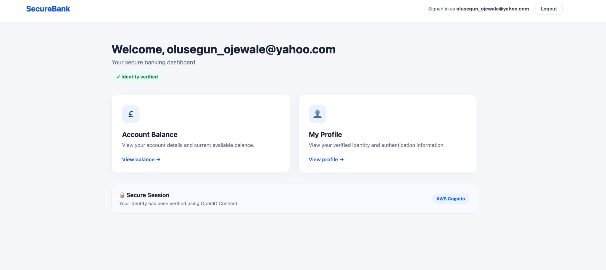

# SecureBank — Keycloak & AWS Cognito OIDC Demo

SecureBank is a small FastAPI banking application demonstrating how the **same application can authenticate users using either Keycloak or AWS Cognito through OpenID Connect (OIDC)**.

The project was created as a practical identity and Zero Trust demonstration. The identity provider can be changed through configuration without rewriting the application's authentication routes or user interface.

---

## Objective

The objective of this project is to demonstrate a modern authentication architecture where the application is **decoupled from the Identity Provider (IdP)**.

The same SecureBank application supports:

- Keycloak
- AWS Cognito
- OpenID Connect (OIDC)
- OAuth 2.0 Authorization Code Flow
- JWT/ID tokens
- Application sessions
- Identity Provider logout
- Provider-independent application code

The architecture is:

```text
                     SecureBank
                       FastAPI
                          │
                          │ OIDC
                          │
                ┌─────────┴─────────┐
                │                   │
                ▼                   ▼
            Keycloak          AWS Cognito
                │                   │
                │ Authentication    │
                └─────────┬─────────┘
                          │
                          ▼
                    OIDC Tokens
                          │
                          ▼
                  SecureBank Session
```

The key idea is that **SecureBank does not need to implement its own authentication system**.

Authentication is delegated to an external Identity Provider.

---

# End Result

Once authenticated, users are presented with the SecureBank dashboard.

The application displays:

- authenticated username/email
- identity verification status
- current Identity Provider
- account balance
- user profile
- logout functionality

The same UI is used regardless of which Identity Provider authenticated the user.

## Keycloak



In this example, SecureBank has authenticated the user through **Keycloak**.

The dashboard displays:

```text
Identity Provider: Keycloak
```

---

## AWS Cognito


The same application can be restarted using AWS Cognito.

The dashboard then displays:

```text
Identity Provider: AWS Cognito
```

No application UI change is required.

---

# Authentication Flow

SecureBank uses the **OIDC Authorization Code Flow**.

```text
User
 │
 │ 1. Open SecureBank
 ▼
FastAPI
 │
 │ 2. /login
 ▼
Identity Provider
(Keycloak / Cognito)
 │
 │ 3. Authenticate
 ▼
Authorization Code
 │
 │ 4. Redirect to
 ▼
http://localhost:9000/callback
 │
 ▼
FastAPI
 │
 │ 5. Exchange code for tokens
 ▼
Identity Provider
 │
 │
 ├── ID Token
 ├── Access Token
 └── Refresh Token
 │
 ▼
FastAPI Session
 │
 ▼
SecureBank Dashboard
```

The ID token identifies the authenticated user.

The access token can subsequently be used to protect APIs and implement authorization.

---

# Project Structure

```text
.
├── app.py
├── Dockerfile
├── docker-compose.yml
├── ba1.png
├── ba2.png
└── README.md
```

### `app.py`

Contains the FastAPI application and the authentication logic.

It includes:

- OIDC provider configuration
- `/login`
- `/callback`
- `/logout`
- `/logged-out`
- `/profile`
- `/balance`
- SecureBank dashboard
- application session handling

### `Dockerfile`

Builds the FastAPI application container.

### `docker-compose.yml`

Runs the application and supporting services.

For the Keycloak environment this can also include:

- Keycloak
- PostgreSQL
- SecureBank/FastAPI

### `ba1.png`

SecureBank authenticated using **Keycloak**.

### `ba2.png`

SecureBank authenticated using **AWS Cognito**.

---

# Identity Provider Selection

The application uses:

```text
AUTH_PROVIDER
```

to determine which Identity Provider should be used.

The current application default is:

```text
cognito
```

Supported values are:

```text
keycloak
cognito
```

This means the application code can use a common OIDC client:

```python
oauth.oidc
```

rather than implementing separate authentication routes for every provider.

Conceptually:

```text
AUTH_PROVIDER=keycloak
        │
        ▼
     Keycloak


AUTH_PROVIDER=cognito
        │
        ▼
   AWS Cognito
```

---

# Keycloak Configuration

The Keycloak realm used by the demo is:

```text
banking
```

The client is:

```text
banking-app
```

For the local environment Keycloak is available at:

```text
http://localhost:8080
```

Configure the Keycloak client with:

```text
Home URL
http://localhost:9000

Valid redirect URIs
http://localhost:9000/callback

Valid post logout redirect URIs
http://localhost:9000/logged-out

Web origins
http://localhost:9000
```

The following authentication flow should be enabled:

```text
Standard Flow: ON
```

---

# AWS Cognito Configuration

Create a Cognito User Pool and an App Client.

The application uses the Cognito OIDC discovery endpoint:

```text
https://cognito-idp.<REGION>.amazonaws.com/<USER_POOL_ID>/.well-known/openid-configuration
```

Configure the Cognito App Client with:

```text
Allowed callback URL

http://localhost:9000/callback
```

Configure:

```text
Allowed sign-out URL

http://localhost:9000/logged-out
```

Enable:

```text
Authorization code grant
```

OIDC scopes used by this demo:

```text
openid
email
```

---

# Environment Configuration

The application reads its authentication configuration from environment variables.

The current defaults in the app are:

```yaml
environment:

  AUTH_PROVIDER: ${AUTH_PROVIDER:-cognito}

  # Keycloak
  KEYCLOAK_REALM: banking
  KEYCLOAK_CLIENT_ID: banking-app
  KEYCLOAK_PUBLIC_URL: http://localhost:8080
  KEYCLOAK_INTERNAL_URL: http://keycloak:8080

  # AWS Cognito
  COGNITO_REGION: eu-west-2
  COGNITO_USER_POOL_ID: <YOUR_USER_POOL_ID>
  COGNITO_CLIENT_ID: <YOUR_CLIENT_ID>
  COGNITO_CLIENT_SECRET: ${COGNITO_CLIENT_SECRET}
  COGNITO_DOMAIN: https://<your-domain>.auth.<region>.amazoncognito.com

  # Shared logout redirect
  LOGOUT_URL: http://localhost:9000/logged-out
```

Do **not** commit real client secrets to Git.

For example:

```bash
export COGNITO_CLIENT_SECRET="your-client-secret"
```

If you are using Keycloak, set:

```bash
export AUTH_PROVIDER=keycloak
```

If you are using Cognito, set:

```bash
export AUTH_PROVIDER=cognito
```

---

# Running the Application

## Prerequisites

You need:

- Docker
- Docker Compose
- a web browser

Verify Docker:

```bash
docker --version
docker compose version
```

---

# Run with the default provider (Cognito)

The application defaults to Cognito unless `AUTH_PROVIDER` is overridden.

Set the required Cognito environment values before starting the app:

```bash
export AUTH_PROVIDER=cognito
export COGNITO_REGION="eu-west-2"
export COGNITO_USER_POOL_ID="<YOUR_USER_POOL_ID>"
export COGNITO_CLIENT_ID="<YOUR_CLIENT_ID>"
export COGNITO_CLIENT_SECRET="your-client-secret"
export COGNITO_DOMAIN="https://<your-domain>.auth.<region>.amazoncognito.com"
```

Then start or rebuild the app:

```bash
docker compose up -d --build
```

Open:

```text
http://localhost:9000
```

Click:

```text
Sign in securely
```

The browser is redirected to AWS Cognito Managed Login.

After authentication:

```text
Cognito
   ↓
Authorization Code
   ↓
SecureBank /callback
   ↓
OIDC Tokens
   ↓
SecureBank Dashboard
```

The dashboard will display:

```text
AWS Cognito
```

---

# Run with Keycloak

Set the authentication provider:

```bash
export AUTH_PROVIDER=keycloak
```

Then start the environment:

```bash
docker compose up -d --build
```

Alternatively:

```bash
AUTH_PROVIDER=keycloak docker compose up -d --build
```

Open:

```text
http://localhost:9000
```

Select:

```text
Sign in securely
```

You will be redirected to Keycloak.

After successful authentication:

```text
Keycloak
   ↓
/callback
   ↓
SecureBank
```

The dashboard will display:

```text
Keycloak
```

as the Identity Provider.

---

# Switching Identity Providers

One of the main objectives of this project is demonstrating how easily the Identity Provider can be changed.

For example:

```bash
AUTH_PROVIDER=keycloak docker compose up -d --build
```

or:

```bash
AUTH_PROVIDER=cognito docker compose up -d --build
```

The application continues to use:

```text
/login
/callback
/profile
/balance
/logout
```

regardless of the provider.

This demonstrates the benefit of using standards such as **OAuth 2.0 and OpenID Connect**.

---

# Application Endpoints

| Endpoint | Purpose |
|---|---|
| `/` | SecureBank home/dashboard |
| `/login` | Starts the OIDC authentication flow |
| `/callback` | Receives the authorization code |
| `/profile` | Displays authenticated identity information |
| `/balance` | Displays account information |
| `/logout` | Starts IdP and application logout |
| `/logged-out` | Post-logout landing page |

---

# Logout

Logout requires clearing **two separate authentication states**.

```text
Application Session
       +
Identity Provider Session
```

Clearing only the FastAPI session isn't sufficient because Keycloak or Cognito may still have an active SSO session.

SecureBank therefore performs:

```text
User clicks Logout
       │
       ▼
Clear FastAPI session
       │
       ▼
Identity Provider logout
       │
       ├── Keycloak
       │
       └── Cognito
       │
       ▼
/logged-out
```

This prevents the Identity Provider from immediately authenticating the user again using an existing SSO session.

---

# Security Notes

This project is designed as a **training/demo application**.

For a production implementation:

- never hard-code client secrets
- use AWS Secrets Manager, Vault or another secrets-management solution
- use HTTPS
- validate access tokens before API access
- validate token issuer and expiry
- validate token audience/client
- implement role/group-based authorization
- use secure session-cookie settings
- restrict redirect URIs
- apply least-privilege IAM permissions
- avoid logging raw access/ID tokens

Any temporary JWT/token debugging used during development should be removed before deployment.

---

# Zero Trust Context

This project represents the **identity layer** of a larger Zero Trust architecture.

```text
                       USER
                        │
                        ▼
              Keycloak / Cognito
                        │
                 Authentication
                        │
                       JWT
                        │
                        ▼
                    API Gateway
                        │
                 JWT Validation
                        │
                        ▼
                   FastAPI
                        │
                Authorization
                        │
                        ▼
                  Microservices
                        │
                  mTLS / Istio
```

The core principle is:

> **Never Trust. Always Verify.**

Authentication establishes identity.

Authorization determines what that identity is permitted to do.

Later stages of the architecture can extend this demo with:

- Cognito Groups / Keycloak Roles
- API-level JWT validation
- Apache APISIX
- Kubernetes
- Istio
- mTLS
- Istio AuthorizationPolicy
- workload identity
- observability and security telemetry
- AI-assisted security analysis

---

# Key Learning Outcomes

This project demonstrates that:

1. Applications do not need to manage user passwords directly.
2. Authentication can be delegated to an Identity Provider.
3. OIDC provides a standard authentication protocol.
4. OAuth 2.0 Authorization Code Flow can be used by different Identity Providers.
5. Keycloak and AWS Cognito can authenticate the same application.
6. FastAPI can remain largely independent of the selected Identity Provider.
7. JWTs provide identity and authorization information to downstream systems.
8. Application logout and Identity Provider logout are separate concerns.
9. Authentication is only the first layer of a Zero Trust architecture.

---

## Tech Stack

- Python
- FastAPI
- Authlib
- OpenID Connect
- OAuth 2.0
- JWT
- Keycloak
- AWS Cognito
- PostgreSQL
- Docker
- Docker Compose

---

## Summary

SecureBank demonstrates a simple but important enterprise identity pattern:

```text
                  APPLICATION
                       │
                    OIDC
                       │
             ┌─────────┴─────────┐
             │                   │
          Keycloak          AWS Cognito
             │                   │
             └─────────┬─────────┘
                       │
                Verified Identity
                       │
                       ▼
                   SecureBank
```

The application remains consistent while the underlying Identity Provider can change.

This provides the foundation for extending the application into a broader **Zero Trust architecture with API security, service identity, mTLS and fine-grained authorization**.